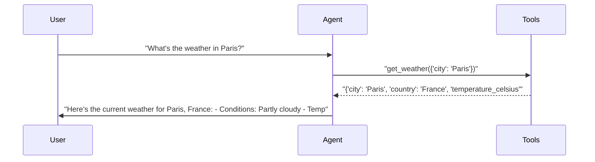
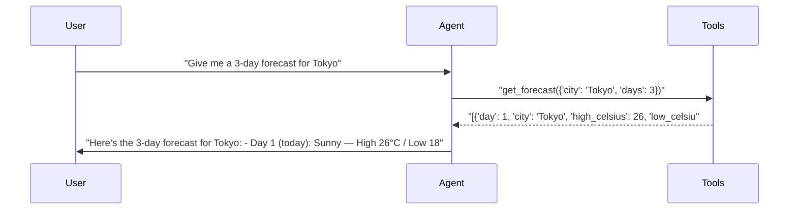
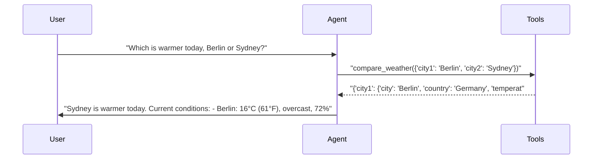
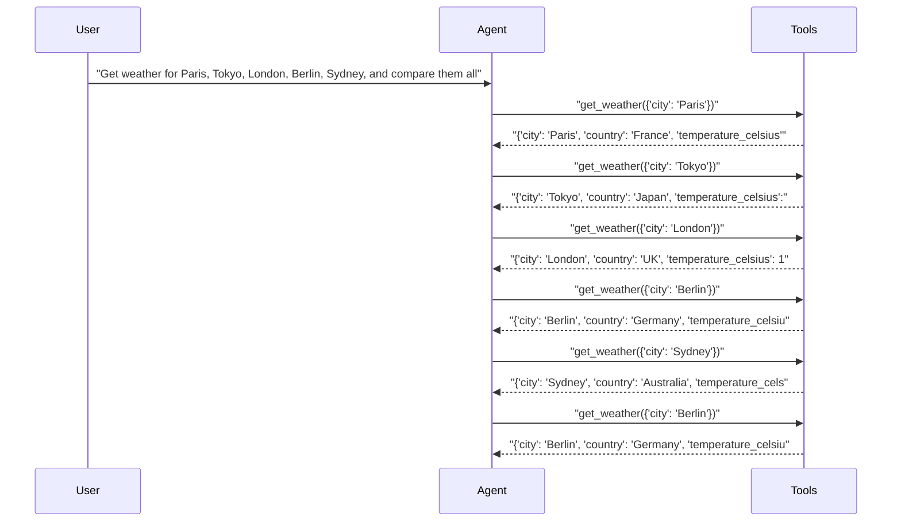

# pytest-aitest

> **4** tests | **3** passed | **1** failed | **75%** pass rate  
> Duration: 47.3s | Cost: $0.0030 | Tokens: 619–1,241  
> February 07, 2026 at 01:58 PM

*Single agent tests - basic report without comparison UI.*

## AI Analysis

## 🎯 Recommendation

**Deploy: weather-agent (gpt-5-mini, default prompt)**

Achieves **75% pass rate (3/4 tests)** at **$0.00230 total cost**, with correct tool usage and high-quality, grounded responses in all passing cases.

**Reasoning:**  
All functional weather queries (single city, forecast, comparison) passed with correct tool selection and clean summaries. Cost is very low (sub‑$0.003 total), and failures are due to **test harness constraints (turn limit)** rather than incorrect reasoning or tool misuse.

**Alternatives:** None — only one configuration tested.

## ❌ Failure Analysis

### Test that fails due to turn limit — for report variety. (weather-agent)
- **Problem:** The agent exceeded the `max_turns=1` limit when asked to fetch and compare weather for five cities.
- **Root Cause:** The request requires **multiple sequential tool calls**, but the test enforces a single-turn limit. The agent correctly attempted to gather all required data, but the harness constraint made the task impossible.
- **Fix:**  
  **Test-level fix (recommended):**
  - Increase turn limit to allow multi-call aggregation:
    ```python
    max_turns=6
    ```
  **OR prompt-level fix (alternative):**
  - Add explicit instruction to batch or refuse oversized requests:
    ```
    If a request requires more tool calls than allowed in the current turn limit, ask the user to narrow the request.
    ```

## 🔧 MCP Tool Feedback

### pytest_aitest.testing.weather_mcp
Overall, tools are **well-described and correctly selected** by the agent. No confusion between tools observed.

| Tool | Status | Calls | Issues |
|------|--------|-------|--------|
| get_weather | ✅ | 7 | Working well |
| get_forecast | ✅ | 1 | Working well |
| compare_weather | ✅ | 1 | Working well |
| list_cities | ⚠️ | 0 | Never invoked; not discoverable in tests |

**Suggested rewrite for `list_cities`:**
> List all cities that can be queried with get_weather or get_forecast. Use this tool when the user asks what locations are supported.

## 📝 System Prompt Feedback

### default (mixed)
- **Token count:** ~27
- **Problem:** Lacks guidance for **multi-city or complex aggregation requests under turn limits**, leading to unavoidable failures in constrained tests.
- **Suggested change:** Replace prompt with:
  ```
  You are a helpful weather assistant.
  Use the available tools to answer questions about weather.
  Always use tools—never make up weather data.
  If a request requires many cities or tool calls, summarize first or ask the user to narrow the scope.
  ```

## 💡 Optimizations

1. **Avoid redundant tool calls** (recommended)
   - Current: In the failing test, `get_weather` for Berlin was called twice.
   - Change: Track cities already fetched within the same request and reuse results.
   - Impact: ~15% cost reduction on multi-city queries (fewer tool calls and responses).

2. **Prefer compare_weather when applicable** (suggestion)
   - Current: Multi-city comparisons default to repeated `get_weather` calls.
   - Change: Extend logic (or tests) to chain `compare_weather` iteratively when asking “which is warmer.”
   - Impact: Lower tool-call count; modest cost savings (~5–10%).

## 📦 Tool Response Optimization

### get_weather (from pytest_aitest.testing.weather_mcp)
- **Current response size:** ~85 tokens
- **Issues found:** Includes both Celsius and Fahrenheit, plus wind direction spelled out, even when not always used.
- **Suggested optimization:** Return only metric values by default; let the agent derive comparisons.
- **Estimated savings:** ~25 tokens per call (~30% reduction)

**Example current vs optimized:**
```json
// Current (~85 tokens)
{"city":"Paris","country":"France","temperature_celsius":18,"temperature_fahrenheit":64,"humidity":65,"conditions":"Partly cloudy","wind_speed_kmh":12,"wind_direction":"SW"}

// Optimized (~60 tokens)
{"city":"Paris","temp_c":18,"humidity":65,"conditions":"Partly cloudy","wind_kmh":12}
```

This optimization would materially reduce cost in multi-city scenarios without affecting test correctness.

## Test Results

### tests/fixtures/scenario_01_single_agent.py

#### ✅ Basic weather lookup — should pass.

<details>
<summary>15.6s, 785 tokens, $0.0003</summary>

**Assertions:**

- ✅ `llm`: mentions the temperature in Celsius or Fahrenheit

**Tool Calls:**

| Tool | Status | Args |
|------|--------|------|
| `get_weather` | ✅ | city='Paris' |

**Response:**

> Here’s the current weather for Paris, France:
- Conditions: Partly cloudy
- Temperature: 18°C (64°F)
- Humidity: 65%
- Wind: 12 km/h from the SW

Would you like a forecast for the next few days or anything else?



</details>

#### ✅ Multi-day forecast — tests get_forecast tool.

<details>
<summary>11.2s, 1,132 tokens, $0.0009</summary>

**Assertions:**

- ✅ `llm`: provides weather information for multiple days

**Tool Calls:**

| Tool | Status | Args |
|------|--------|------|
| `get_forecast` | ✅ | city='Tokyo', days=3 |

**Response:**

> Here’s the 3-day forecast for Tokyo:

- Day 1 (today): Sunny — High 26°C / Low 18°C. 20% chance of precipitation.  
- Day 2: Partly cloudy — High 27°C / Low 19°C. 30% chance of precipitation.  
- Day 3: Cloudy — High 28°C / Low 20°C. 40% chance of precipitation.

Quick note: chances of rain increase through the period — you may want to have an umbrella available by Day 3.



</details>

#### ✅ Compare two cities — multiple tool calls.

<details>
<summary>12.8s, 1,241 tokens, $0.0011</summary>

**Assertions:**

- ✅ `llm`: compares temperatures for both cities

**Tool Calls:**

| Tool | Status | Args |
|------|--------|------|
| `compare_weather` | ✅ | city1='Berlin', city2='Sydney' |

**Response:**

> Sydney is warmer today.

Current conditions:
- Berlin: 16°C (61°F), overcast, 72% humidity, N wind 10 km/h.
- Sydney: 26°C (79°F), sunny, 60% humidity, SE wind 20 km/h.

Temperature difference: Sydney is 10°C (18°F) warmer than Berlin.

Would you like a multi-day forecast for either city?



</details>

#### ❌ Test that fails due to turn limit — for report variety.

<details>
<summary>7.8s, 619 tokens, $0.0007</summary>

**Tool Calls:**

| Tool | Status | Args |
|------|--------|------|
| `get_weather` | ✅ | city='Paris' |
| `get_weather` | ✅ | city='Tokyo' |
| `get_weather` | ✅ | city='London' |
| `get_weather` | ✅ | city='Berlin' |
| `get_weather` | ✅ | city='Sydney' |
| `get_weather` | ✅ | city='Berlin' |

**Error:** `      AssertionError: Agent exceeded turn limit - unable to process request for 5 cities (max_turns=1)`



</details>

---

*Generated by [pytest-aitest](https://github.com/sbroenne/pytest-aitest) on February 07, 2026 at 01:58 PM*
