# pytest-aitest

> **4** tests | **3** passed | **1** failed | **75%** pass rate  
> Duration: 37.2s | Cost: 🧪 $-0.013151 · 🤖 $0.0153 · 💰 $0.002150 | Tokens: 509–1,322  
> February 07, 2026 at 07:19 PM

*Single agent tests - basic report without comparison UI.*

> **banking-agent** — ❌ 1 Failed  
> 3/4 tests | $0.002150 | 3,786 tokens | 37.2s

## AI Analysis

Recommended for Deploy

banking-agent

Handles core banking actions reliably with correct tool usage and low total cost. All single-step and standard multi-step tests pass; the only failure is due to an external turn-limit constraint, not tool misuse.

75%Pass Rate

$0.002150Total Cost

3,786Tokens

4

Total Tests

1

Failures

1

Agents

2.8

Avg Turns

## ❌ Failure Analysis

### Failure Summary

**banking-agent** (1 failure)

| Test | Root Cause | Fix |
|------|------------|-----|
| Test that fails due to turn limit — for report variety | Max turns set to 1 prevents completing a required multi-step workflow | Increase `max_turns` to ≥3 or split into sequential tests |

### Test that fails due to turn limit — for report variety (banking-agent)
- **Problem:** The user requested a compound workflow: check balances → transfer funds → show updated balances → show transaction history.
- **Root Cause:** Test configuration enforced `max_turns=1`, terminating the agent after the first tool call (`get_all_balances`) before it could proceed to `transfer` and `get_transactions`.
- **Behavioral Mechanism:** Not prompt-induced. The agent correctly interpreted the multi-step intent but was hard-stopped by the turn limit before planning and executing subsequent tool calls.
- **Fix:** Increase the test configuration to `max_turns: 3` (or higher), or refactor the scenario into multiple sequential tests with shared session context.

## 🔧 MCP Tool Feedback

### banking-server
Overall, tools are well-described and consistently invoked. The agent selected the correct tool in all passing tests without hesitation or confusion.

| Tool | Status | Calls | Issues |
|------|--------|-------|--------|
| get_balance | ✅ | 1 | Working well |
| transfer | ✅ | 1 | Working well |
| get_transactions | ✅ | 1 | Working well |
| get_all_balances | ✅ | 1 | Working well |

## 💡 Optimizations

| # | Optimization | Priority | Estimated Savings |
|---|-------------|----------|-------------------|
| 1 | Increase turn limit for compound workflows | recommended | Prevents ~25% test failure rate |
| 2 | Reduce verbosity in user-facing follow-ups | suggestion | ~10–15% token reduction |

#### 1. Increase turn limit for compound workflows (recommended)
- Current: Tests with `max_turns=1` fail when a user request explicitly requires multiple tool calls.
- Change: Set `max_turns` to at least 3 for scenarios involving chained actions (balance → transfer → report).
- Impact: Eliminates the only observed failure, raising pass rate from 75% to 100% with no cost increase.

#### 2. Reduce verbosity in user-facing follow-ups (suggestion)
- Current: After successful tool calls, the agent offers multiple optional next steps in bullet lists.
- Change: Trim follow-up prompts to a single concise question (e.g., “Anything else I can help with?”).
- Impact: ~10–15% cost reduction from fewer completion tokens, especially in high-volume usage.

## Test Results

### tests/fixtures/scenario_01_single_agent.py

#### ✅ Basic balance check — should pass.

13.7s · 931 tokens · 3 turns · $0.000338

**Assertions:**

- ✅ `llm`: mentions the checking account balance amount

**Tool Calls:**

|Tool|Status|Args|
| :--- | :---: | :--- |
|`get_balance`|✅|account='checking'|

**Response:**

> Your checking account balance is $1,500.00. Would you like to do anything else with your accounts (transfer, withdraw, deposit, see transactions)?

#### ✅ Transfer money — tests the transfer tool.

7.1s · 1,024 tokens · 3 turns · $0.000401

**Assertions:**

- ✅ `llm`: confirms the transfer was completed

**Tool Calls:**

|Tool|Status|Args|
| :--- | :---: | :--- |
|`transfer`|✅|from_account='checking', to_account='savings', amount=200|

**Response:**

> Done — I transferred $200 from your checking to savings. Your new balances:
> - Checking: $1,300.00
> - Savings: $3,200.00
> 
> Would you like a receipt or anything else?

```mermaid
sequenceDiagram
    participant User
    participant Agent
    participant Tools

    User->>Agent: "Transfer $200 from checking to savings"
    Agent->>Tools: "transfer({'from_account': 'checking', 'to_account': 'savings', 'amoun)"
    Tools-->>Agent: "{'transaction_id': 'TX0001', 'type': 'transfer', 'from_accou"
    Agent->>User: "Done — I transferred $200 from your checking to savings. Your new balances: - Ch"
```

#### ✅ View transactions — multiple tool calls possible.

11.9s · 1,322 tokens · 3 turns · $0.001134

**Assertions:**

- ✅ `llm`: shows transaction or balance information

**Tool Calls:**

|Tool|Status|Args|
| :--- | :---: | :--- |
|`get_transactions`|✅|limit=20|

**Response:**

> I checked your recent transactions (up to 20) across all accounts and found none. That means there are no posted transactions in the timeframe queried.
> 
> Would you like to:
> - Show current balances for all accounts?
> - Check transactions for a specific account (checking or savings) or a different number of transactions?
> - Look for pending transactions?
> - Make a deposit, withdrawal, or transfer?
> 
> Tell me which option and any details (account, amount, or how many transactions to retrieve) and I’ll ta

#### ❌ Test that fails due to turn limit — for report variety.

4.5s · 509 tokens · 2 turns · $0.000278

**Tool Calls:**

|Tool|Status|Args|
| :--- | :---: | :--- |
|`get_all_balances`|✅||

**Error:** `      AssertionError: Agent exceeded turn limit - unable to process multi-step request (max_turns=1)`

*Generated by [pytest-aitest](https://github.com/sbroenne/pytest-aitest) on February 07, 2026 at 07:19 PM*
