# pytest-aitest

> **6** tests | **5** passed | **1** failed | **83%** pass rate  
> Duration: 82.4s | Cost: $0.0095 | Tokens: 579–5,903  
> February 07, 2026 at 02:02 PM

*Three agents for testing the agent selector UI.*

## Agent Leaderboard

| # | Agent | Pass Rate | Cost | Tokens | Duration |
|---|-------|-----------|------|--------|----------|
| 1 | gpt-4.1-mini 🏆 | 100% (2/2) | $0.0007 | 1,288 | 17.1s |
| 2 | gpt-5-mini | 100% (2/2) | $0.0026 | 3,044 | 33.2s |
| 3 | gpt-5-mini + weather-expert | 50% (1/2) | $0.0061 | 8,623 | 32.1s |

## AI Analysis

## 🎯 Recommendation

**Deploy: gpt-4.1-mini + default system prompt**

Achieves **100% pass rate at ~60% lower cost** than the next best alternative while using tools correctly and concisely.

**Reasoning:**  
- **Pass rate:** gpt-4.1-mini passed all tests (100%), matching gpt-5-mini without skill and outperforming the weather‑expert configuration (which failed one test).  
- **Cost:**  
  - gpt-4.1-mini total cost across tests: **~$0.00072**  
  - gpt-5-mini (no skill): **~$0.00265** → **~73% higher cost**  
  - gpt-5-mini + weather-expert: **~$0.00614** → **~750% higher cost**  
- **Response quality:** Clear, correct, and appropriately scoped to the questions without unnecessary tool calls or verbosity.

**Alternatives:**  
- **gpt-5-mini (default prompt):** Same pass rate but ~3.7× higher cost with no quality advantage.  
- **gpt-5-mini + weather-expert:** **Disqualified** due to test failure and extreme cost overhead; only suitable if actionable clothing advice is a hard requirement and tests are adjusted accordingly.

## ❌ Failure Analysis

### Multiple cities — tests differentiation between agents. (gpt-5-mini + weather-expert)
- **Problem:** Test expected ≥3 `get_weather` calls, but the agent made **0** and instead used `compare_weather`, causing an assertion failure.
- **Root Cause:**  
  - The **system prompt + skill Tool Usage Pattern** explicitly instructs the agent to use `compare_weather` for comparisons.  
  - The **test expectation** is implicitly coupled to `get_weather` usage, creating a mismatch between prompt intent and test assertion.
- **Fix:** Choose one of the following (recommended first):
  1. **Fix the test assertion** to accept `compare_weather` as valid:
     ```python
     assert tool_call_count("get_weather") + tool_call_count("compare_weather") >= 3
     ```
  2. **Or fix the system prompt** to force `get_weather` usage for multi-city comparisons:
     > Replace in **Tool Usage Pattern**:  
     > “Use `compare_weather` when comparing locations” 
     > with:  
     > “When comparing more than two locations, call `get_weather` separately for each city instead of using `compare_weather`.”

## 🔧 MCP Tool Feedback

### pytest_aitest.testing.weather_mcp
Overall, tools work reliably, but **overlap between `get_weather` and `compare_weather` causes confusion** in test expectations.

| Tool | Status | Calls | Issues |
|------|--------|-------|--------|
| get_weather | ✅ | 8 | Working well |
| list_cities | ✅ | 3 | Working well |
| compare_weather | ⚠️ | 3 | Overlaps with `get_weather` semantics |

**Suggested rewrite for `compare_weather`:**
> Compare the current weather between exactly two cities.  
> **Use this tool only when the user explicitly asks for a pairwise comparison.**  
> For comparisons involving more than two cities, call `get_weather` separately for each city.

## 📝 System Prompt Feedback

### default (effective)
- **Token count:** ~20
- **Assessment:** Clear, minimal, and consistently followed across models.
- **Change:** None recommended.

### Weather Expert Assistant (mixed)
- **Token count:** ~250+ (excluding skill references)
- **Problem:**  
  - Overly prescriptive tool-order rules conflict with existing tests.  
  - Forces extra tool calls (`list_cities`, skill reads) even for trivial queries.
- **Suggested change:**  
  Replace the “Always follow this sequence” section with:
  > “Use only the minimum set of tools required to answer the user’s question correctly. Prefer `get_weather` for simple queries.”

## 📚 Skill Feedback

### weather-expert (negative)
- **Usage rate:** Referenced in 1/3 conversations; unnecessary for basic queries
- **Token cost:** ~4,000+ tokens per run when fully loaded
- **Problem:**  
  - Massive token overhead relative to test scope  
  - Clothing guide irrelevant to simple weather and comparison tests
- **Suggested change:**  
  - Split into two skills:
    1. `weather-basics` (no references, tool rules only)
    2. `clothing-advice` (clothing-guide.md, loaded on demand)
  - Gate skill loading behind explicit user intent (e.g., “what should I wear”).

## 💡 Optimizations

1. **Remove skill from baseline tests** (recommended)
   - Current: weather-expert skill loaded for all queries
   - Change: Use default prompt with no skill unless advice is requested
   - Impact: **~85% cost reduction** per test, ~70% fewer tokens

2. **Clarify comparison semantics** (recommended)
   - Current: Tests expect `get_weather`, prompt prefers `compare_weather`
   - Change: Align either test assertions or prompt rules (see Failure Analysis)
   - Impact: Eliminates false negatives; saves ~$0.0025 per failed run

## 📦 Tool Response Optimization

### get_weather (from pytest_aitest.testing.weather_mcp)
- **Current response size:** ~45 tokens
- **Issues found:**  
  - Both Celsius and Fahrenheit always returned, but agents typically use only one.
- **Suggested optimization:**  
  - Add an optional `units` parameter (`"metric"` | `"imperial"`) and return only relevant fields.
- **Estimated savings:** ~10 tokens per call (~22% reduction)

**Example current vs optimized:**
```json
// Current (~45 tokens)
{"city":"Berlin","country":"Germany","temperature_celsius":16,"temperature_fahrenheit":61,"humidity":72,"conditions":"Overcast","wind_speed_kmh":10,"wind_direction":"N"}

// Optimized (~35 tokens)
{"city":"Berlin","temperature_celsius":16,"humidity":72,"conditions":"Overcast","wind_kmh":10,"wind_dir":"N"}
```

## Test Results

### tests/fixtures/scenario_04_agent_selector.py

#### ✅ Basic weather query — all agents should pass.

<details>
<summary>✅ gpt-5-mini — 15.2s, 989 tokens, $0.0008</summary>

**Assertions:**

- ✅ `llm`: provides the current temperature and conditions for Berlin

**Tool Calls:**

| Tool | Status | Args |
|------|--------|------|
| `get_weather` | ✅ | city='Berlin' |

**Response:**

> Current weather in Berlin:
- Temperature: 16°C (61°F)
- Conditions: Overcast
- Humidity: 72%
- Wind: N at 10 km/h

Looks cool and cloudy — a light jacket is a good idea. Would you like a multi-day forecast or the weather for a different city?

```mermaid
sequenceDiagram
    participant User
    participant Agent
    participant Tools

    User->>Agent: "What's the weather in Berlin?"
    Agent->>Tools: "get_weather({'city': 'Berlin'})"
    Tools-->>Agent: "{'city': 'Berlin', 'country': 'Germany', 'temperature_celsiu"
    Agent->>User: "Current weather in Berlin: - Temperature: 16°C (61°F) - Conditions: Overcast - H"
```



</details>

<details>
<summary>✅ gpt-4.1-mini — 7.7s, 579 tokens, $0.0003</summary>

**Assertions:**

- ✅ `llm`: provides the current temperature and conditions for Berlin

**Tool Calls:**

| Tool | Status | Args |
|------|--------|------|
| `get_weather` | ✅ | city='Berlin' |

**Response:**

> The current weather in Berlin is overcast with a temperature of 16°C (61°F). The humidity is at 72%, and there is a north wind blowing at 10 km/h.

```mermaid
sequenceDiagram
    participant User
    participant Agent
    participant Tools

    User->>Agent: "What's the weather in Berlin?"
    Agent->>Tools: "get_weather({'city': 'Berlin'})"
    Tools-->>Agent: "{'city': 'Berlin', 'country': 'Germany', 'temperature_celsiu"
    Agent->>User: "The current weather in Berlin is overcast with a temperature of 16°C (61°F). The"
```



</details>

<details>
<summary>✅ gpt-5-mini + weather-expert — 18.7s, 5,903 tokens, $0.0036</summary>

**Assertions:**

- ✅ `llm`: provides the current temperature and conditions for Berlin

**Tool Calls:**

| Tool | Status | Args |
|------|--------|------|
| `list_cities` | ✅ |  |
| `get_weather` | ✅ | city='Berlin' |
| `list_skill_references` | ✅ |  |
| `read_skill_reference` | ✅ | filename='clothing-guide.md' |

**Response:**

> Current conditions in Berlin: 16°C (61°F), overcast, humidity 72%, wind N at 10 km/h (≈6 mph).

What to wear / bring (specific):
- Outer layer: light jacket or windbreaker (16°C/61°F is mild but overcast and slightly damp).  
- Base layer: T‑shirt or light long‑sleeve; bring a light sweater or cardigan for cooler moments.  
- Bottoms: long pants or jeans.  
- Shoes: closed‑toe shoes (sneakers); consider water‑resistant shoes if you expect damp sidewalks.  
- Extras: compact umbrella or packable 

```mermaid
sequenceDiagram
    participant User
    participant Agent
    participant Tools

    User->>Agent: "What's the weather in Berlin?"
    Agent->>Tools: "list_cities({})"
    Tools-->>Agent: "['Paris', 'Tokyo', 'New York', 'Berlin', 'London', 'Sydney']"
    Agent->>Tools: "get_weather({'city': 'Berlin'})"
    Tools-->>Agent: "{'city': 'Berlin', 'country': 'Germany', 'temperature_celsiu"
    Agent->>Tools: "list_skill_references({})"
    Tools-->>Agent: "Available reference documents: - clothing-guide.md"
    Agent->>Tools: "read_skill_reference({'filename': 'clothing-guide.md'})"
    Tools-->>Agent: "# Weather Clothing Guide ## Temperature-Based Clothing ### C"
    Agent->>User: "Current conditions in Berlin: 16°C (61°F), overcast, humidity 72%, wind N at 10 "
```



</details>

#### ❌ Multiple cities — tests differentiation between agents.

<details>
<summary>✅ gpt-5-mini — 17.9s, 2,055 tokens, $0.0019</summary>

**Assertions:**

- ✅ `llm`: mentions weather for Rome, Madrid, and Athens

**Tool Calls:**

| Tool | Status | Args |
|------|--------|------|
| `get_weather` | ✅ | city='Rome' |
| `get_weather` | ✅ | city='Madrid' |
| `get_weather` | ✅ | city='Athens' |
| `list_cities` | ✅ |  |

**Response:**

> I can’t fetch live weather for Rome, Madrid, or Athens — those cities aren’t in the available data set. The cities I can retrieve now are: Paris, Tokyo, New York, Berlin, London, Sydney.

What would you like to do next?
- Pick any two or three from the available list for a live comparison (I can fetch current weather or a multi-day forecast).
- Or, if you want Rome, Madrid, and Athens specifically, I can provide a general (non-live) climatological comparison instead — does that work?

```mermaid
sequenceDiagram
    participant User
    participant Agent
    participant Tools

    User->>Agent: "Compare weather in Rome, Madrid, and Athens"
    Agent->>Tools: "get_weather({'city': 'Rome'})"
    Tools-->>Agent: "City 'Rome' not found. Available cities: Paris, Tokyo, New Y"
    Agent->>Tools: "get_weather({'city': 'Madrid'})"
    Tools-->>Agent: "City 'Madrid' not found. Available cities: Paris, Tokyo, New"
    Agent->>Tools: "get_weather({'city': 'Athens'})"
    Tools-->>Agent: "City 'Athens' not found. Available cities: Paris, Tokyo, New"
    Agent->>Tools: "list_cities({})"
    Tools-->>Agent: "['Paris', 'Tokyo', 'New York', 'Berlin', 'London', 'Sydney']"
    Agent->>User: "I can’t fetch live weather for Rome, Madrid, or Athens — those cities aren’t in "
```



</details>

<details>
<summary>✅ gpt-4.1-mini — 9.3s, 709 tokens, $0.0004</summary>

**Assertions:**

- ✅ `llm`: mentions weather for Rome, Madrid, and Athens

**Tool Calls:**

| Tool | Status | Args |
|------|--------|------|
| `get_weather` | ✅ | city='Rome' |
| `get_weather` | ✅ | city='Madrid' |
| `get_weather` | ✅ | city='Athens' |

**Response:**

> Currently, I do not have weather data available for Rome, Madrid, and Athens. The cities I can provide weather information for are Paris, Tokyo, New York, Berlin, London, and Sydney. Would you like me to compare the weather in any of these cities instead?


</details>

<details>
<summary>❌ gpt-5-mini + weather-expert — 13.4s, 2,720 tokens, $0.0025</summary>

**Tool Calls:**

| Tool | Status | Args |
|------|--------|------|
| `list_cities` | ✅ |  |
| `compare_weather` | ✅ | city1='Rome', city2='Madrid' |
| `compare_weather` | ✅ | city1='Rome', city2='Athens' |
| `compare_weather` | ✅ | city1='Madrid', city2='Athens' |

**Error:** `      AssertionError: assert 0 >= 3
       +  where 0 = tool_call_count('get_weather')
       +    where tool_call_count = AgentResult(SUCCESS)\n  Turns: 3\n  Tools called: compare_weather, list_cities\n  Duration: 10154ms\n  Tokens: 2720 | Cost: $0.002493\n  Final: 'I tried to fetch current weather for Rome, Madrid, and Athens but those cities are not in the availa'....tool_call_count`

**Response:**

> I tried to fetch current weather for Rome, Madrid, and Athens but those cities are not in the available dataset. The weather API currently has data for: Paris, Tokyo, New York, Berlin, London, and Sydney.

How would you like to proceed?
- Pick one of the available cities above for a comparison (e.g., Paris vs London vs Berlin).
- Or provide alternate city names (or correct spellings / countries) if you want me to try again for Rome, Madrid, Athens.
- If you want, I can compare typical climate/se


</details>

---

*Generated by [pytest-aitest](https://github.com/sbroenne/pytest-aitest) on February 07, 2026 at 02:02 PM*
