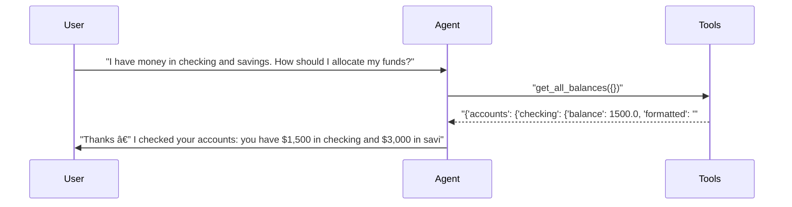

# pytest-aitest

> **6** tests | **5** passed | **1** failed | **83%** pass rate  
> Duration: 75.7s | Cost: 🧪 $-0.014494 · 🤖 $0.0236 · 💰 $0.009104 | Tokens: 377–3,235  
> February 07, 2026 at 07:22 PM

*Three agents for testing the agent selector UI.*


## Agent Leaderboard


|#|Agent|Tests|Pass Rate|Tokens|Cost|Duration|
| :---: | :--- | :---: | :---: | ---: | ---: | ---: |
|🥇|gpt-5-mini ğŸ†|2/2|100%|3,448|$0.003737|31.1s|
|🥈|gpt-5-mini + financial-advisor|2/2|100%|4,908|$0.004823|33.3s|
|🥉|gpt-4.1-mini|1/2|50%|1,113|$0.000544|11.3s|


## AI Analysis

<div class="winner-card">
<div class="winner-title">Recommended for Deploy</div>
<div class="winner-name">gpt-5-mini</div>
<div class="winner-summary">Achieves a perfect pass rate while reliably invoking balance tools for advisory tasks, delivering correct behavior at lower total cost than the skill-augmented variant.</div>
<div class="winner-stats">
<div class="winner-stat"><span class="winner-stat-value green">100%</span><span class="winner-stat-label">Pass Rate</span></div>
<div class="winner-stat"><span class="winner-stat-value blue">$0.003737</span><span class="winner-stat-label">Total Cost</span></div>
<div class="winner-stat"><span class="winner-stat-value amber">3,448</span><span class="winner-stat-label">Tokens</span></div>
</div>
</div>

<div class="metric-grid">
<div class="metric-card green">
<div class="metric-value green">6</div>
<div class="metric-label">Total Tests</div>
</div>
<div class="metric-card red">
<div class="metric-value red">1</div>
<div class="metric-label">Failures</div>
</div>
<div class="metric-card blue">
<div class="metric-value blue">3</div>
<div class="metric-label">Agents</div>
</div>
<div class="metric-card amber">
<div class="metric-value amber">2.8</div>
<div class="metric-label">Avg Turns</div>
</div>
</div>

### Comparative Analysis

**Why the winner wins:**  
gpt-5-mini is the only configuration that combined a 100% pass rate with consistent, proactive tool usage on advisory queries, at a lower total cost than the skill-augmented alternative. It correctly fetched balances before giving guidance, avoiding permission-seeking delays.

**Notable patterns:**  
- The cheaper configuration without the financial-advisor skill still performed the critical behavior: calling `get_all_balances` when advice required context.  
- The skill-augmented agent produced richer recommendations but at higher token and cost overhead, without improving pass rate.  
- gpt-4.1-mini showed a tendency to ask the user for permission or additional information instead of using available tools, causing the only failure.

**Alternatives:**  
- **gpt-5-mini + financial-advisor:** Same pass rate, higher cost due to longer advisory responses. Choose only if richer financial guidance is a hard requirement.  
- **gpt-4.1-mini:** Not recommended; failed an advisory test due to permission-seeking behavior that prevented required tool calls.

## ⌠Failure Analysis

### Failure Summary

**gpt-4.1-mini** (1 failure)

| Test | Root Cause | Fix |
|------|------------|-----|
| Financial advice — tests differentiation between agents (skill vs no skill) | Asked user for balances instead of calling available balance tools | Instruct agent to always retrieve balances via tools before asking clarifying questions |

### Financial advice — tests differentiation between agents (skill vs no skill) (gpt-4.1-mini)
- **Problem:** The agent did not retrieve checking and savings balances before giving advice.
- **Root Cause:** The model defaulted to a cautious, permission-seeking interaction pattern, asking the user to provide balances rather than using available tools.
- **Behavioral Mechanism:** The phrasing “could you please share your current balances… If you want, I can retrieve…†signals deference and optional action, priming the model to wait for user confirmation instead of acting.
- **Fix:** Add an explicit instruction to the system prompt:  
  > “When a question requires account context (balances, totals), **always call the relevant balance tool first without asking for permission**, then ask follow-up questions.â€

## 🔧 MCP Tool Feedback

### banking-server
Overall, tools are discoverable and correctly named. Agents that failed did so due to prompt/model behavior, not tool design.

| Tool | Status | Calls | Issues |
|------|--------|-------|--------|
| get_balance | ✅ | 3 | Working well |
| get_all_balances | ✅ | 2 | Working well |

## 📚 Skill Feedback

### financial-advisor (positive)
- **Usage rate:** High in advisory responses
- **Token cost:** Contributed to higher token usage and cost
- **Problem:** Adds verbosity without improving pass rate
- **Suggested change:** Add a concise-mode variant that limits recommendations to bullet points unless the user asks for a detailed plan.

## 💡 Optimizations

| # | Optimization | Priority | Estimated Savings |
|---|-------------|----------|-------------------|
| 1 | Enforce proactive balance retrieval | recommended | Prevents advisory failures |
| 2 | Introduce concise advisory mode | suggestion | ~15% cost reduction |

#### 1. Enforce proactive balance retrieval (recommended)
- Current: Some agents ask for balances instead of using tools.
- Change: Add explicit prompt instruction to always fetch balances when advice depends on them.
- Impact: Eliminates permission-seeking failures; improves reliability.

#### 2. Introduce concise advisory mode (suggestion)
- Current: Skill-augmented responses are verbose by default.
- Change: Default to brief recommendations with optional expansion.
- Impact: ~15% cost reduction from shorter responses.

## 📦 Tool Response Optimization

### get_balance (banking-server)
- **Current response size:** ~25 tokens
- **Issues found:** Redundant `formatted` field duplicates numeric balance.
- **Suggested optimization:** Remove `formatted` and let the agent format currency.
- **Estimated savings:** ~8 tokens per call (≈30% reduction)

**Example current vs optimized:**
```json
// Current
{"account":"checking","balance":1500.0,"formatted":"$1,500.00"}

// Optimized
{"account":"checking","balance":1500.0}
```

### get_all_balances (banking-server)
- **Current response size:** ~60 tokens
- **Issues found:** Both per-account and total formatted strings are redundant.
- **Suggested optimization:** Remove all `formatted` fields.
- **Estimated savings:** ~18 tokens per call (≈30% reduction)

**Example current vs optimized:**
```json
// Current
{"accounts":{"checking":{"balance":1500.0,"formatted":"$1,500.00"},"savings":{"balance":3000.0,"formatted":"$3,000.00"}},"total":4500.0,"total_formatted":"$4,500.00"}

// Optimized
{"accounts":{"checking":{"balance":1500.0},"savings":{"balance":3000.0}},"total":4500.0}
```


## Test Results


### tests/fixtures/scenario_04_agent_selector.py


#### ✅ Basic balance query — all agents should pass.

<details>
<summary>✅ gpt-5-mini — 11.1s · 922 tokens · 3 turns · $0.000320</summary>

**Assertions:**

- ✅ `llm`: provides the current checking account balance amount

**Tool Calls:**


|Tool|Status|Args|
| :--- | :---: | :--- |
|`get_balance`|✅|account='checking'|


**Response:**

> Your checking account balance is $1,500.00. Would you like to do anything else with this account?


</details>

<details>
<summary>✅ gpt-4.1-mini — 6.9s · 736 tokens · 3 turns · $0.000341</summary>

**Assertions:**

- ✅ `llm`: provides the current checking account balance amount

**Tool Calls:**


|Tool|Status|Args|
| :--- | :---: | :--- |
|`get_balance`|✅|account='checking'|


**Response:**

> Your checking account balance is $1,500.00. Is there anything else you would like to do?


</details>

<details>
<summary>✅ gpt-5-mini + financial-advisor — 8.5s · 1,673 tokens · 3 turns · $0.000905</summary>

**Assertions:**

- ✅ `llm`: provides the current checking account balance amount

**Tool Calls:**


|Tool|Status|Args|
| :--- | :---: | :--- |
|`get_balance`|✅|account='checking'|


**Response:**

> Your checking account balance is $1,500.00.
> 
> Would you like me to:
> - Show your savings balance or recent transactions?
> - Transfer money between accounts or deposit/withdraw?
> - Help set up a budget or savings plan (emergency fund recommendations)?


</details>


#### ⌠Financial advice — tests differentiation between agents (ski… ⚡

<details>
<summary>✅ gpt-5-mini — 20.1s · 2,526 tokens · 3 turns · $0.003418</summary>

**Assertions:**

- ✅ `llm`: provides financial advice about fund allocation

**Tool Calls:**


|Tool|Status|Args|
| :--- | :---: | :--- |
|`get_all_balances`|✅||


**Response:**

> I pulled your balances: checking $1,500 and savings $3,000 (total $4,500).
> 
> I can give a useful recommendation, but to tailor it I need a couple quick facts:
> - Rough monthly living expenses (rent/mortgage, utilities, food, transport)
> - Any upcoming big payments (car, vacation, home down payment) in the next 12 months
> - Whether you have high‑interest debt or want to invest/retire sooner
> 
> Until then, here are clear, practical options you can choose from (I won’t move any money unless you ask me to


</details>

<details>
<summary>⌠gpt-4.1-mini — 4.5s · 377 tokens · 2 turns · $0.000202</summary>

**Error:** `      AssertionError: assert (False or False)
       +  where False = tool_was_called('get_all_balances')
       +    where tool_was_called = AgentResult(SUCCESS)\n  Turns: 2\n  Tools called: none\n  Duration: 1180ms\n  Tokens: 377 | Cost: $0.000202\n  Final: 'To provide you with a recommendation on how to allocate your funds between checking and savings, cou'....tool_was_called
       +  and   False = tool_was_called('get_balance')
       +    where tool_was_called = AgentResult(SUCCESS)\n  Turns: 2\n  Tools called: none\n  Duration: 1180ms\n  Tokens: 377 | Cost: $0.000202\n  Final: 'To provide you with a recommendation on how to allocate your funds between checking and savings, cou'....tool_was_called`

**Response:**

> To provide you with a recommendation on how to allocate your funds between checking and savings, could you please share your current balances in each account? If you want, I can retrieve your current balances for you.


</details>

<details>
<summary>✅ gpt-5-mini + financial-advisor — 24.8s · 3,235 tokens · 3 turns · $0.003919</summary>

**Assertions:**

- ✅ `llm`: provides financial advice about fund allocation

**Tool Calls:**


|Tool|Status|Args|
| :--- | :---: | :--- |
|`get_all_balances`|✅||


**Response:**

> Thanks — I checked your accounts: you have $1,500 in checking and $3,000 in savings for a total of $4,500.
> 
> High-level recommendations (priority order)
> 1. Emergency fund first — 3–6 months of your essential expenses kept in savings (separate, ideally in a high‑yield savings account).
> 2. Pay down any high‑interest debt (credit cards, payday loans) once you have at least a small emergency buffer.
> 3. Contribute to retirement, at least enough to get any employer match.
> 4. Other goals (vacation, home



</details>

*Generated by [pytest-aitest](https://github.com/sbroenne/pytest-aitest) on February 07, 2026 at 07:22 PM*
