# pytest-aitest

> **6** tests | **6** passed | **0** failed | **100%** pass rate  
> Duration: 67.9s | Cost: 🧪 $-0.016718 · 🤖 $0.0233 · 💰 $0.006595 | Tokens: 910–3,452  
> February 07, 2026 at 07:36 PM

*Prompt comparison — same model, different system prompts.*


## Agent Leaderboard


|#|Agent|Tests|Pass Rate|Tokens|Cost|Duration|
| :---: | :--- | :---: | :---: | ---: | ---: | ---: |
|🥇|gpt-5-mini + concise 🏆|2/2|100%|1,956|$0.000727|19.3s|
|🥈|gpt-5-mini + structured|2/2|100%|3,067|$0.002753|23.4s|
|🥉|gpt-5-mini + detailed|2/2|100%|4,523|$0.003115|25.2s|


## AI Analysis

<div class="winner-card">
<div class="winner-title">Recommended for Deploy</div>
<div class="winner-name">gpt-5-mini + concise</div>
<div class="winner-summary">Delivers a perfect pass rate at the lowest cost, using only the necessary tools and producing clear, compact answers without extra steps.</div>
<div class="winner-stats">
<div class="winner-stat"><span class="winner-stat-value green">100%</span><span class="winner-stat-label">Pass Rate</span></div>
<div class="winner-stat"><span class="winner-stat-value blue">$0.000727</span><span class="winner-stat-label">Total Cost</span></div>
<div class="winner-stat"><span class="winner-stat-value amber">1,956</span><span class="winner-stat-label">Tokens</span></div>
</div>
</div>

<div class="metric-grid">
<div class="metric-card green">
<div class="metric-value green">6</div>
<div class="metric-label">Total Tests</div>
</div>
<div class="metric-card red">
<div class="metric-value red">0</div>
<div class="metric-label">Failures</div>
</div>
<div class="metric-card blue">
<div class="metric-value blue">3</div>
<div class="metric-label">Agents</div>
</div>
<div class="metric-card amber">
<div class="metric-value amber">3.3</div>
<div class="metric-label">Avg Turns</div>
</div>
</div>

## Comparative Analysis

**Why the winner wins:**  
The concise prompt achieves the same 100% pass rate as the structured and detailed variants at a fraction of the cost. It avoids unnecessary pre- and post-action tool calls and limits explanation length, resulting in the lowest realized cost per test while still satisfying response quality requirements.

**Notable patterns:**  
- Prompt verbosity directly drives tool usage. The detailed prompt triggered extra `get_all_balances` calls before and after transfers, inflating tokens and cost without improving test outcomes.  
- Structured formatting adds moderate overhead. Emoji headers and repeated status blocks increased tokens compared to concise free-text, with no functional gain.  
- The cheaper configuration is not a weaker one. All agents used the same model; cost differences are entirely attributable to prompt-induced behavior, not model capability.

**Alternatives:**  
- **gpt-5-mini + structured:** Same correctness with clearer visual structure, but ~4× higher total cost. Suitable only if formatted, dashboard-like output is a hard requirement.  
- **gpt-5-mini + detailed:** Most verbose and most expensive. Provides narrative explanations and redundant balance checks that are unnecessary for these tasks.

## 🔧 MCP Tool Feedback

### banking_server
Overall, tools are discoverable and correctly invoked. The main inefficiency comes from prompt-driven overuse rather than tool design flaws.

| Tool | Status | Calls | Issues |
|------|--------|-------|--------|
| get_balance | ✅ | 3 | Working well |
| transfer | ✅ | 3 | Working well |
| get_all_balances | ⚠️ | 2 | Called unnecessarily by detailed prompt |

**Suggested rewrite for `get_all_balances`:**
> Returns balances for all accounts. Use only when the user explicitly asks for *all* balances or a portfolio summary. Do not call this tool for single-account queries or simple transfers.

## 📝 System Prompt Feedback

### concise (effective)
- **Token count:** Low
- **Behavioral impact:** Language emphasizes direct action and brief explanation, priming the model to call exactly one required tool and respond succinctly.
- **Problem:** None observed
- **Suggested change:** None

### structured (effective)
- **Token count:** Medium
- **Behavioral impact:** Encourages labeled sections and status indicators, increasing response length but not altering tool correctness.
- **Problem:** Extra formatting tokens without functional benefit
- **Suggested change:** Remove repeated “Status: success” lines to reduce output length.

### detailed (mixed)
- **Token count:** High
- **Behavioral impact:** Words like “explain” and the implied expectation of completeness prime the model to gather before/after state, leading to redundant balance checks.
- **Problem:** Over-instrumentation and narrative verbosity
- **Suggested change:** Replace “explain what happened” guidance with:  
  > “Briefly summarize the result in 1–2 sentences without additional verification steps.”

## 💡 Optimizations

| # | Optimization | Priority | Estimated Savings |
|---|-------------|----------|-------------------|
| 1 | Default to concise prompt | recommended | ~70% cost reduction |
| 2 | Constrain explanatory language | recommended | ~30% fewer tokens |

#### 1. Default to concise prompt (recommended)
- Current: Multiple prompt styles used with identical correctness.
- Change: Make the concise prompt the default for transactional flows.
- Impact: ~70% cost reduction with no loss in pass rate.

#### 2. Constrain explanatory language (recommended)
- Current: “Explain what happened” triggers extra narration and tool calls in detailed prompts.
- Change: Explicitly cap explanations to 1–2 sentences and forbid additional verification tools.
- Impact: ~30% fewer tokens on transfer-style tests.

## 📦 Tool Response Optimization

### get_all_balances (from banking_server)
- **Current response size:** High (includes totals and formatted duplicates)
- **Issues found:** Redundant fields (`total`, `total_formatted`) not used by any agent; verbose nested structure.
- **Suggested optimization:** Return only per-account balances when called in test contexts.
- **Estimated savings:** ~40% tokens per call

**Example current vs optimized:**
```json
// Current
{
  "accounts": {
    "checking": {"balance": 1500.0, "formatted": "$1,500.00"},
    "savings": {"balance": 3000.0, "formatted": "$3,000.00"}
  },
  "total": 4500.0,
  "total_formatted": "$4,500.00"
}

// Optimized
{
  "checking": 1500.0,
  "savings": 3000.0
}
```


## Test Results


### tests/fixtures/scenario_05_prompt_comparison.py


#### ✅ Balance query — tests how prompt style affects response form…

<details>
<summary>✅ gpt-5-mini + concise — 11.8s · 910 tokens · 3 turns · $0.000296</summary>

**Assertions:**

- ✅ `llm`: states the checking account balance

**Tool Calls:**


|Tool|Status|Args|
| :--- | :---: | :--- |
|`get_balance`|✅|account='checking'|


**Response:**

> Your checking balance: $1,500.00.


</details>

<details>
<summary>✅ gpt-5-mini + detailed — 7.7s · 1,071 tokens · 3 turns · $0.000485</summary>

**Assertions:**

- ✅ `llm`: states the checking account balance

**Tool Calls:**


|Tool|Status|Args|
| :--- | :---: | :--- |
|`get_balance`|✅|account='checking'|


**Response:**

> Your checking account balance is $1,500.00. Would you like to do anything with that account (transfer, withdraw, view transactions, etc.)?


</details>

<details>
<summary>✅ gpt-5-mini + structured — 6.9s · 1,047 tokens · 3 turns · $0.000472</summary>

**Assertions:**

- ✅ `llm`: states the checking account balance

**Tool Calls:**


|Tool|Status|Args|
| :--- | :---: | :--- |
|`get_balance`|✅|account='checking'|


**Response:**

> 💰 Account: checking
> 📊 Balance: $1,500.00
> 📋 Action: Retrieved balance
> ✅ Status: success



</details>


```mermaid
sequenceDiagram
    participant User
    participant Agent
    participant Tools

    User->>Agent: "What's my checking account balance?"
    Agent->>Tools: "get_balance({'account': 'checking'})"
    Tools-->>Agent: "{'account': 'checking', 'balance': 1500.0, 'formatted': '$1,"
    Agent->>User: "💰 Account: checking 📊 Balance: $1,500.00 📋 Action: Retrieved balance ✅ Status: s"
```

#### ✅ Transfer with explanation — tests prompt impact on response …

<details>
<summary>✅ gpt-5-mini + concise — 7.6s · 1,046 tokens · 3 turns · $0.000431</summary>

**Assertions:**

- ✅ `llm`: confirms the transfer was completed

**Tool Calls:**


|Tool|Status|Args|
| :--- | :---: | :--- |
|`transfer`|✅|from_account='checking', to_account='savings', amount=300|


**Response:**

> Done — transferred $300.00 from checking to savings.
> 
> Checking new balance: $1,200.00
> Savings new balance: $3,300.00
> 
> What happened: $300.00 was debited from your checking and credited to your savings. Transaction ID TX0001.

```mermaid
sequenceDiagram
    participant User
    participant Agent
    participant Tools

    User->>Agent: "Transfer $300 from checking to savings and explain what happened"
    Agent->>Tools: "transfer({'from_account': 'checking', 'to_account': 'savings', 'amoun)"
    Tools-->>Agent: "{'transaction_id': 'TX0001', 'type': 'transfer', 'from_accou"
    Agent->>User: "Done — transferred $300.00 from checking to savings. Checking new balance: $1,20"
```



</details>

<details>
<summary>✅ gpt-5-mini + detailed — 17.5s · 3,452 tokens · 5 turns · $0.002631</summary>

**Assertions:**

- ✅ `llm`: confirms the transfer was completed

**Tool Calls:**


|Tool|Status|Args|
| :--- | :---: | :--- |
|`get_all_balances`|✅||
|`transfer`|✅|from_account='checking', to_account='savings', amount=300|
|`get_all_balances`|✅||


**Response:**

> Here’s what I did and what happened.
> 
> Current balances (before the transfer)
> - Checking: $1,500.00
> - Savings: $3,000.00
> - Total across accounts: $4,500.00
> 
> Requested action
> - Transfer $300.00 from checking to savings.
> 
> Transfer details and result
> - Amount transferred: $300.00
> - From account: checking
> - To account: savings
> - Transaction ID: TX0001
> - Status: Successful
> 
> Balances after the transfer
> - Checking: $1,200.00 (was $1,500.00)
> - Savings: $3,300.00 (was $3,000.00)
> - Total across accounts: $

```mermaid
sequenceDiagram
    participant User
    participant Agent
    participant Tools

    User->>Agent: "Transfer $300 from checking to savings and explain what happened"
    Agent->>Tools: "get_all_balances({})"
    Tools-->>Agent: "{'accounts': {'checking': {'balance': 1500.0, 'formatted': '"
    Agent->>Tools: "transfer({'from_account': 'checking', 'to_account': 'savings', 'amoun)"
    Tools-->>Agent: "{'transaction_id': 'TX0001', 'type': 'transfer', 'from_accou"
    Agent->>Tools: "get_all_balances({})"
    Tools-->>Agent: "{'accounts': {'checking': {'balance': 1200.0, 'formatted': '"
    Agent->>User: "Here’s what I did and what happened. Current balances (before the transfer) - Ch"
```



</details>

<details>
<summary>✅ gpt-5-mini + structured — 16.5s · 2,020 tokens · 3 turns · $0.002281</summary>

**Assertions:**

- ✅ `llm`: confirms the transfer was completed

**Tool Calls:**


|Tool|Status|Args|
| :--- | :---: | :--- |
|`transfer`|✅|from_account='checking', to_account='savings', amount=300|


**Response:**

> 💰 Account: checking
> 📊 Balance: $1,200.00
> 📋 Action: Transferred $300.00 out to savings (TX0001)
> ✅ Status: success
> 
> 💰 Account: savings
> 📊 Balance: $3,300.00
> 📋 Action: Received $300.00 transfer from checking (TX0001)
> ✅ Status: success
> 
> What happened: I moved $300.00 from your checking account into your savings account. The transfer debited checking and credited savings immediately, resulting in the balances shown above. Transaction ID TX0001 confirms the successful transfer. If you’d like, I can sho

```mermaid
sequenceDiagram
    participant User
    participant Agent
    participant Tools

    User->>Agent: "Transfer $300 from checking to savings and explain what happened"
    Agent->>Tools: "transfer({'from_account': 'checking', 'to_account': 'savings', 'amoun)"
    Tools-->>Agent: "{'transaction_id': 'TX0001', 'type': 'transfer', 'from_accou"
    Agent->>User: "💰 Account: checking 📊 Balance: $1,200.00 📋 Action: Transferred $300.00 out to sa"
```



</details>

*Generated by [pytest-aitest](https://github.com/sbroenne/pytest-aitest) on February 07, 2026 at 07:36 PM*
