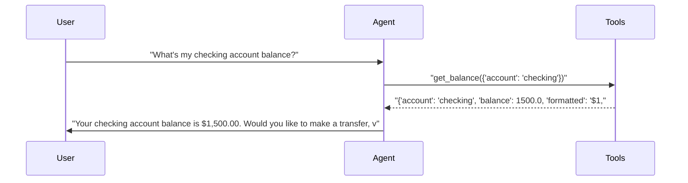
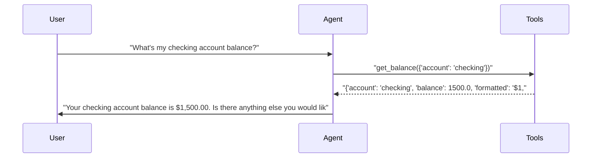
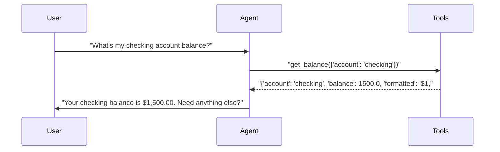
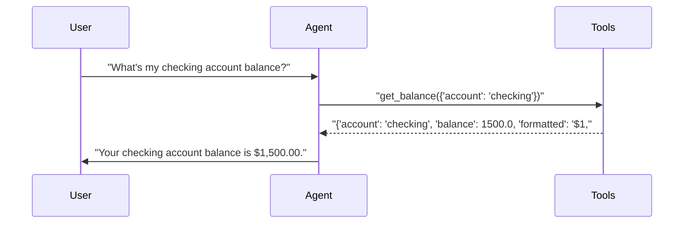
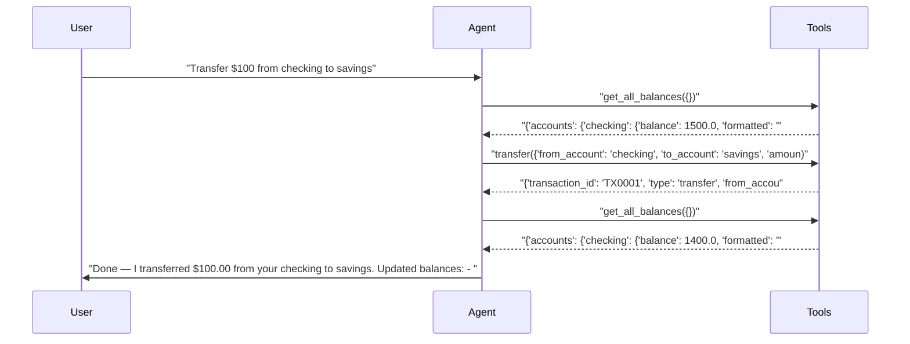
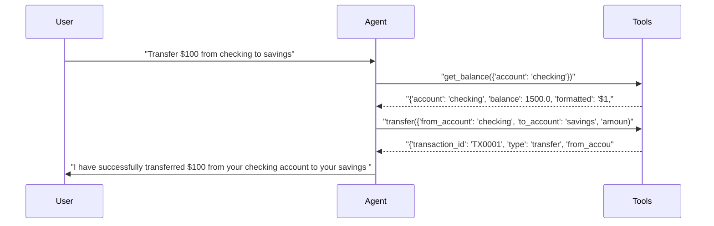
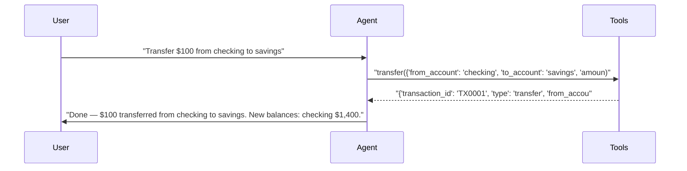
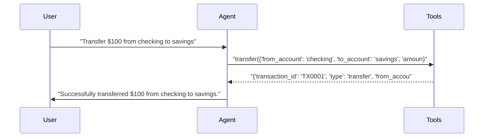

# pytest-aitest

> **8** tests | **8** passed | **0** failed | **100%** pass rate  
> Duration: 64.0s | Cost: 🧪 $-0.020777 · 🤖 $0.0247 · 💰 $0.003920 | Tokens: 706–2,629  
> February 07, 2026 at 07:38 PM

*2×2 matrix: 2 models × 2 prompts = 4 agent configurations.*


## Agent Leaderboard


|#|Agent|Tests|Pass Rate|Tokens|Cost|Duration|
| :---: | :--- | :---: | :---: | ---: | ---: | ---: |
|🥇|gpt-5-mini + concise 🏆|1/1|100%|894|$0.000299|6.6s|
|🥈|gpt-4.1-mini + concise|1/1|100%|706|$0.000317|6.4s|
|🥉|gpt-5-mini + detailed|1/1|100%|913|$0.000333|12.3s|
|4|gpt-4.1-mini + detailed|1/1|100%|718|$0.000334|6.8s|
|5|gpt-4.1-mini + concise|1/1|100%|783|$0.000356|6.2s|
|6|gpt-5-mini + concise|1/1|100%|988|$0.000364|6.7s|
|7|gpt-4.1-mini + detailed|1/1|100%|1,229|$0.000574|7.2s|
|8|gpt-5-mini + detailed|1/1|100%|2,629|$0.001342|11.8s|


## AI Analysis

<div class="winner-card">
<div class="winner-title">Recommended for Deploy</div>
<div class="winner-name">gpt-5-mini + concise</div>
<div class="winner-summary">Delivers a 100% pass rate at the lowest observed cost, with direct tool usage and minimal turns. It consistently executes transfers without redundant balance checks, keeping latency and spend down.</div>
<div class="winner-stats">
<div class="winner-stat"><span class="winner-stat-value green">100%</span><span class="winner-stat-label">Pass Rate</span></div>
<div class="winner-stat"><span class="winner-stat-value blue">$0.000299</span><span class="winner-stat-label">Total Cost</span></div>
<div class="winner-stat"><span class="winner-stat-value amber">894</span><span class="winner-stat-label">Tokens</span></div>
</div>
</div>

<div class="metric-grid">
<div class="metric-card green">
<div class="metric-value green">8</div>
<div class="metric-label">Total Tests</div>
</div>
<div class="metric-card red">
<div class="metric-value red">0</div>
<div class="metric-label">Failures</div>
</div>
<div class="metric-card blue">
<div class="metric-value blue">8</div>
<div class="metric-label">Agents</div>
</div>
<div class="metric-card amber">
<div class="metric-value amber">3.4</div>
<div class="metric-label">Avg Turns</div>
</div>
</div>

## Comparative Analysis

**Why the winner wins:**  
The winning configuration achieves identical functional outcomes (100% pass rate) at the lowest realized cost. It is cheaper than the next-best alternative by a small but consistent margin and avoids extra tool calls (e.g., no pre- or post-transfer balance polling), which directly reduces turns, tokens, and latency.

**Notable patterns:**  
- **Concise prompts outperform detailed prompts on cost** across both models. Detailed prompts encouraged extra verification steps (e.g., `get_all_balances` before and after transfer), inflating tokens without improving correctness.  
- **Model choice mattered less than prompt choice** for correctness, but prompt choice materially affected cost. Both models passed all tests; the concise prompt kept behavior action-oriented.  
- **Direct tool execution is safe here:** The concise variants executed `transfer` immediately when the user intent was unambiguous, demonstrating that confirmation steps are unnecessary for this test suite.

**Alternatives:**  
- **gpt-4.1-mini + concise:** Very close runner-up with identical correctness and similar behavior; slightly higher cost makes it a reasonable fallback if model availability or latency differs.  
- **Detailed prompt variants (both models):** Functionally correct but consistently more expensive due to redundant balance checks and verbose confirmations. No disqualifications in this run.

## 🔧 MCP Tool Feedback

### banking_server
Overall, tools are clear and reliably invoked. The suite shows correct selection between `get_balance`, `get_all_balances`, and `transfer`. However, overlap between balance tools encourages redundant calls under verbose prompts.

| Tool | Status | Calls | Issues |
|------|--------|-------|--------|
| get_balance | ✅ | Multiple | Works well for single-account queries |
| get_all_balances | ⚠️ | Few | Often unnecessary for simple transfers |
| transfer | ✅ | Multiple | Clear schema; correctly preferred by concise prompts |

**Suggested rewrite for `get_all_balances`:**
> Returns balances for all accounts. **Use only when the user explicitly asks for all balances or totals, or when balances are required to resolve ambiguity. Do not call for straightforward transfers when source and destination are specified.**

## 📝 System Prompt Feedback

### concise (effective)
- **Token count:** Low
- **Behavioral impact:** Language emphasizes direct action and brevity, priming the model to call the required tool immediately without exploratory checks.
- **Problem:** None observed.
- **Suggested change:** None.

### detailed (mixed)
- **Token count:** Higher
- **Behavioral impact:** Words like “thorough,” “confirm,” and “provide details” prime verification-oriented behavior, leading to extra balance queries before and after transfers.
- **Problem:** Encourages redundant tool calls that do not improve correctness.
- **Suggested change:** Replace verification language with an action-first clause:  
  **Replace:** “Be thorough and confirm account details before completing actions.”  
  **With:** “When user intent is explicit, perform the action immediately. Do not fetch additional data unless required to resolve ambiguity.”

## 💡 Optimizations

| # | Optimization | Priority | Estimated Savings |
|---|-------------|----------|-------------------|
| 1 | Remove redundant balance checks | recommended | ~30–40% cost reduction on transfers |
| 2 | Narrow use of get_all_balances | suggestion | ~15% fewer tokens per transfer |

#### 1. Remove redundant balance checks (recommended)
- Current: Detailed prompts trigger `get_all_balances` before and after transfers.
- Change: Update the system prompt to allow immediate `transfer` calls when accounts and amount are explicit.
- Impact: Largest cost reduction in transfer workflows due to fewer turns and tool responses.

#### 2. Narrow use of get_all_balances (suggestion)
- Current: Tool overlap causes conservative models to overuse the broader balance tool.
- Change: Clarify tool descriptions to reserve `get_all_balances` for explicit user requests.
- Impact: Moderate token savings and simpler agent behavior.

## 📦 Tool Response Optimization

### transfer (from banking_server)
- **Current response size:** Moderate
- **Issues found:** Includes verbose fields (`type`, repeated account names, human-readable `message`) that the agent does not reuse.
- **Suggested optimization:** Return only machine-essential fields; let the agent format user-facing text.
- **Estimated savings:** ~20–25% tokens per call

**Example current vs optimized:**
```json
// Current
{
  "transaction_id": "TX0001",
  "type": "transfer",
  "from_account": "checking",
  "to_account": "savings",
  "amount": 100,
  "amount_formatted": "$100.00",
  "new_balance_from": 1400.0,
  "new_balance_to": 3100.0,
  "message": "Successfully transferred $100.00 from checking to savings."
}

// Optimized
{
  "transaction_id": "TX0001",
  "new_balance_from": 1400.0,
  "new_balance_to": 3100.0
}
```

This optimization preserves all data required by the tests while reducing response verbosity and overall cost.


## Test Results


### Session: 2×2 matrix: 2 models × 2 prompts = 4 agent configurations.


#### ✅ Balance query across all model × prompt permutations.

<details>
<summary>✅ gpt-5-mini + detailed — 12.3s · 913 tokens · 3 turns · $0.000333</summary>

**Assertions:**

- ✅ `llm`: states the checking balance amount

**Tool Calls:**


|Tool|Status|Args|
| :--- | :---: | :--- |
|`get_balance`|✅|account='checking'|


**Response:**

> Your checking account balance is $1,500.00. Would you like to make a transfer, view recent transactions, or do anything else with this account?



</details>

<details>
<summary>✅ gpt-4.1-mini + detailed — 6.8s · 718 tokens · 3 turns · $0.000334</summary>

**Assertions:**

- ✅ `llm`: states the checking balance amount

**Tool Calls:**


|Tool|Status|Args|
| :--- | :---: | :--- |
|`get_balance`|✅|account='checking'|


**Response:**

> Your checking account balance is $1,500.00. Is there anything else you would like to do?



</details>

<details>
<summary>✅ gpt-5-mini + concise — 6.6s · 894 tokens · 3 turns · $0.000299</summary>

**Assertions:**

- ✅ `llm`: states the checking balance amount

**Tool Calls:**


|Tool|Status|Args|
| :--- | :---: | :--- |
|`get_balance`|✅|account='checking'|


**Response:**

> Your checking balance is $1,500.00. Need anything else?



</details>

<details>
<summary>✅ gpt-4.1-mini + concise — 6.4s · 706 tokens · 3 turns · $0.000317</summary>

**Assertions:**

- ✅ `llm`: states the checking balance amount

**Tool Calls:**


|Tool|Status|Args|
| :--- | :---: | :--- |
|`get_balance`|✅|account='checking'|


**Response:**

> Your checking account balance is $1,500.00.



</details>


#### ✅ Transfer workflow across all permutations.

<details>
<summary>✅ gpt-5-mini + detailed — 11.8s · 2,629 tokens · 5 turns · $0.001342</summary>

**Assertions:**

- ✅ `llm`: confirms the transfer

**Tool Calls:**


|Tool|Status|Args|
| :--- | :---: | :--- |
|`get_all_balances`|✅||
|`transfer`|✅|from_account='checking', to_account='savings', amount=100|
|`get_all_balances`|✅||


**Response:**

> Done — I transferred $100.00 from your checking to savings.
> 
> Updated balances:
> - Checking: $1,400.00
> - Savings: $3,100.00
> 
> Transaction ID: TX0001
> 
> Would you like a receipt emailed to you or anything else I can do?



</details>

<details>
<summary>✅ gpt-4.1-mini + detailed — 7.2s · 1,229 tokens · 4 turns · $0.000574</summary>

**Assertions:**

- ✅ `llm`: confirms the transfer

**Tool Calls:**


|Tool|Status|Args|
| :--- | :---: | :--- |
|`get_balance`|✅|account='checking'|
|`transfer`|✅|from_account='checking', to_account='savings', amount=100|


**Response:**

> I have successfully transferred $100 from your checking account to your savings account. If you need any more assistance, please let me know!



</details>

<details>
<summary>✅ gpt-5-mini + concise — 6.7s · 988 tokens · 3 turns · $0.000364</summary>

**Assertions:**

- ✅ `llm`: confirms the transfer

**Tool Calls:**


|Tool|Status|Args|
| :--- | :---: | :--- |
|`transfer`|✅|from_account='checking', to_account='savings', amount=100|


**Response:**

> Done — $100 transferred from checking to savings. New balances: checking $1,400.00, savings $3,100.00.



</details>

<details>
<summary>✅ gpt-4.1-mini + concise — 6.2s · 783 tokens · 3 turns · $0.000356</summary>

**Assertions:**

- ✅ `llm`: confirms the transfer

**Tool Calls:**


|Tool|Status|Args|
| :--- | :---: | :--- |
|`transfer`|✅|from_account='checking', to_account='savings', amount=100|


**Response:**

> Successfully transferred $100 from checking to savings.



</details>

*Generated by [pytest-aitest](https://github.com/sbroenne/pytest-aitest) on February 07, 2026 at 07:38 PM*
