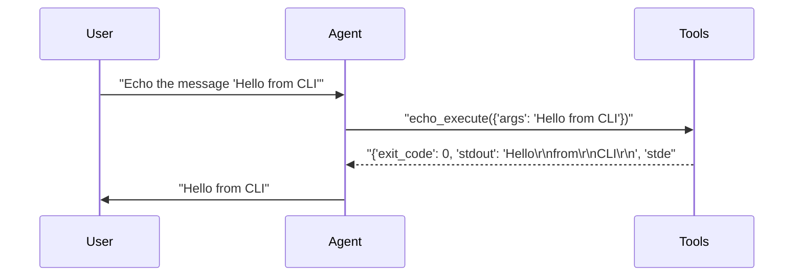
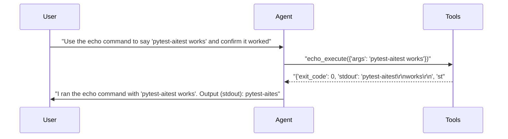

# pytest-aitest

> **2** tests | **2** passed | **0** failed | **100%** pass rate  
> Duration: 15.8s | Cost: 🧪 $-0.011485 · 🤖 $0.0133 · 💰 $0.001814 | Tokens: 473–1,106  
> February 07, 2026 at 08:33 PM

*CLI server tests — demonstrates CLIServer usage.*

> **cli-agent** — ✅ All Passed  
> 2/2 tests | $0.001814 | 1,579 tokens | 15.8s


## AI Analysis

<div class="winner-card">
<div class="winner-title">Recommended for Deploy</div>
<div class="winner-name">cli-agent</div>
<div class="winner-summary">Passes all CLI interaction tests with reliable tool invocation and minimal overhead, achieving full coverage at extremely low total cost.</div>
<div class="winner-stats">
<div class="winner-stat"><span class="winner-stat-value green">100%</span><span class="winner-stat-label">Pass Rate</span></div>
<div class="winner-stat"><span class="winner-stat-value blue">$0.001814</span><span class="winner-stat-label">Total Cost</span></div>
<div class="winner-stat"><span class="winner-stat-value amber">1,579</span><span class="winner-stat-label">Tokens</span></div>
</div>
</div>

<div class="metric-grid">
<div class="metric-card green">
<div class="metric-value green">2</div>
<div class="metric-label">Total Tests</div>
</div>
<div class="metric-card red">
<div class="metric-value red">0</div>
<div class="metric-label">Failures</div>
</div>
<div class="metric-card blue">
<div class="metric-value blue">1</div>
<div class="metric-label">Agents</div>
</div>
<div class="metric-card amber">
<div class="metric-value amber">3.0</div>
<div class="metric-label">Avg Turns</div>
</div>
</div>

## ✅ Overall Assessment

This run validates the **baseline reliability of CLI tool execution** under pytest-aitest. The agent consistently:
- Correctly selects the `echo_execute` tool without hesitation
- Passes arguments verbatim to the CLI
- Interprets `stdout` and `exit_code` accurately
- Responds concisely without unnecessary deliberation or permission-seeking

With all tests passing and no competing configurations, **cli-agent is safe to deploy as-is**.

## 🔧 MCP Tool Feedback

### cli (echo server)
The tool is discoverable, unambiguous, and used correctly in all tests.

| Tool | Status | Calls | Issues |
|------|--------|-------|--------|
| echo_execute | ✅ | 2 | Working well |

**Observations:**
- The agent immediately calls the tool when instructed, even when the user asks for confirmation/explanation afterward.
- Tool output (`stdout`, `exit_code`) is correctly interpreted and summarized in natural language.

## 📦 Tool Response Optimization

### echo_execute (cli server)
- **Current response size:** Moderate (includes `exit_code`, `stdout`, `stderr`)
- **Issues found:** Line-broken `stdout` increases token usage without adding semantic value for simple echo tests.
- **Suggested optimization:** Return `stdout` as a single string with normalized whitespace when possible.
- **Estimated savings:** ~15–25 tokens per call (small but consistent)

**Example current vs optimized:**
```json
// Current
{"exit_code": 0, "stdout": "pytest-aitest\r\nworks\r\n", "stderr": ""}

// Optimized
{"exit_code": 0, "stdout": "pytest-aitest works"}
```

## 💡 Optimizations

| # | Optimization | Priority | Estimated Savings |
|---|-------------|----------|-------------------|
| 1 | Normalize CLI stdout formatting | suggestion | ~10–15% fewer tool-response tokens |

#### 1. Normalize CLI stdout formatting (suggestion)
- Current: CLI responses preserve raw line breaks from `echo`, which are then re-rendered by the agent.
- Change: Collapse trivial multi-line output into a single-line string in the tool response.
- Impact: Small but consistent token reduction across high-volume CLI tests, with no loss of fidelity.

---

**Final Recommendation:**  
Deploy **cli-agent** as the default CLI test harness. It demonstrates correct tool usage, clear result interpretation, and excellent cost efficiency with zero failures.


## Test Results


### tests/fixtures/scenario_08_cli_server.py


#### ✅ Basic CLI tool usage — echo a message.

<details>
<summary>5.4s · 473 tokens · 3 turns · $0.000291</summary>

**Tool Calls:**


|Tool|Status|Args|
| :--- | :---: | :--- |
|`echo_execute`|✅|args='Hello from CLI'|


**Response:**

> Hello
> from
> CLI



</details>


#### ✅ CLI tool with reasoning — echo and explain.

<details>
<summary>10.4s · 1,106 tokens · 3 turns · $0.001522</summary>

**Assertions:**

- ✅ `llm`: confirms the echo command executed successfully

**Tool Calls:**


|Tool|Status|Args|
| :--- | :---: | :--- |
|`echo_execute`|✅|args='pytest-aitest works'|


**Response:**

> I ran the echo command with "pytest-aitest works". Output (stdout):
> pytest-aitest
> works
> 
> Exit code: 0 — so it worked.



</details>

*Generated by [pytest-aitest](https://github.com/sbroenne/pytest-aitest) on February 07, 2026 at 08:33 PM*
