# pytest-aitest

> **4** tests | **4** passed | **0** failed | **100%** pass rate  
> Duration: 32.7s | Cost: 🧪 $-0.018086 · 🤖 $0.0204 · 💰 $0.002304 | Tokens: 892–2,033  
> February 07, 2026 at 08:33 PM

*A/B server comparison — verbose vs terse system prompts.*


## Agent Leaderboard


|#|Agent|Tests|Pass Rate|Tokens|Cost|Duration|
| :---: | :--- | :---: | :---: | ---: | ---: | ---: |
|🥇|terse-prompt 🏆|2/2|100%|2,602|$0.001062|13.6s|
|🥈|verbose-prompt|2/2|100%|3,086|$0.001242|19.1s|


## AI Analysis

<div class="winner-card">
<div class="winner-title">Recommended for Deploy</div>
<div class="winner-name">terse-prompt</div>
<div class="winner-summary">Delivers a 100% pass rate at lower realized cost than the verbose alternative while maintaining reliable multi-step tool chaining.</div>
<div class="winner-stats">
<div class="winner-stat"><span class="winner-stat-value green">100%</span><span class="winner-stat-label">Pass Rate</span></div>
<div class="winner-stat"><span class="winner-stat-value blue">$0.001062</span><span class="winner-stat-label">Total Cost</span></div>
<div class="winner-stat"><span class="winner-stat-value amber">2,602</span><span class="winner-stat-label">Tokens</span></div>
</div>
</div>

<div class="metric-grid">
<div class="metric-card green">
<div class="metric-value green">4</div>
<div class="metric-label">Total Tests</div>
</div>
<div class="metric-card red">
<div class="metric-value red">0</div>
<div class="metric-label">Failures</div>
</div>
<div class="metric-card blue">
<div class="metric-value blue">2</div>
<div class="metric-label">Agents</div>
</div>
<div class="metric-card amber">
<div class="metric-value amber">3.5</div>
<div class="metric-label">Avg Turns</div>
</div>
</div>

## Comparative Analysis

**Why the winner wins:**  
terse-prompt achieves the same 100% pass rate as verbose-prompt at a lower realized cost ($0.001062 vs $0.001242 total) and with fewer tokens. It consistently chains tools correctly (transfer → get_all_balances) without extra verbosity.

**Notable patterns:**  
- The verbose prompt did not improve correctness on multi-step tasks; both agents executed identical tool sequences successfully.  
- Verbosity primarily increased response length and token usage rather than tool reliability or accuracy.

**Alternatives:**  
- **verbose-prompt:** Identical pass rate with slightly higher cost and token usage. Choose only if the additional conversational detail (e.g., receipts prompts) is explicitly desired.

## 📝 System Prompt Feedback

### terse-prompt (effective)
- **Token count:** Lower overall usage across both tests
- **Behavioral impact:** Direct language encourages immediate tool invocation and concise confirmations without preambles.
- **Problem:** None observed.
- **Suggested change:** None required.

### verbose-prompt (effective)
- **Token count:** Higher due to expanded confirmations and follow-up questions
- **Behavioral impact:** Polite, explanatory phrasing adds conversational value but increases verbosity after tool calls.
- **Problem:** Extra language increases cost without improving outcomes.
- **Suggested change:** Remove optional follow-ups unless explicitly requested.
  > Replace: “Would you like a receipt for the transfer or the transaction ID?” 
  > With: “(Receipt available on request.)”

## 💡 Optimizations

| # | Optimization | Priority | Estimated Savings |
|---|-------------|----------|-------------------|
| 1 | Prefer terse system prompt | recommended | ~15% cost reduction |
| 2 | Trim tool response payloads | suggestion | ~20–30% fewer tokens per call |

#### 1. Prefer terse system prompt (recommended)
- Current: Two prompts yield identical correctness.
- Change: Standardize on terse-prompt for production.
- Impact: ~15% cost reduction with no loss in pass rate.

#### 2. Trim tool response payloads (suggestion)
- Current: Tool responses include formatted strings and totals not always used.
- Change: Return only fields required by tests and common responses.
- Impact: ~20–30% fewer tokens per tool call, compounding savings in multi-step flows.

## 📦 Tool Response Optimization

### transfer
- **Current response size:** Includes redundant formatted fields and message text.
- **Issues found:** `amount_formatted`, `message` duplicate information already inferable.
- **Suggested optimization:** Return balances and IDs only.
- **Estimated savings:** ~25 tokens per call (≈20% reduction)

**Example current vs optimized:**
```json
// Current
{
  "transaction_id":"TX0001",
  "type":"transfer",
  "from_account":"checking",
  "to_account":"savings",
  "amount":100,
  "amount_formatted":"$100.00",
  "new_balance_from":1400.0,
  "new_balance_to":3100.0,
  "message":"Successfully transferred $100.00 from checking to savings."
}

// Optimized
{
  "transaction_id":"TX0001",
  "new_balance_from":1400.0,
  "new_balance_to":3100.0
}
```

### get_all_balances
- **Current response size:** Includes totals and formatted strings.
- **Issues found:** `total` and `total_formatted` are optional for most replies.
- **Suggested optimization:** Omit totals unless explicitly requested.
- **Estimated savings:** ~15 tokens per call (≈25% reduction)

**Example current vs optimized:**
```json
// Current
{"accounts":{"checking":{"balance":1400.0,"formatted":"$1,400.00"},"savings":{"balance":3100.0,"formatted":"$3,100.00"}},"total":4500.0,"total_formatted":"$4,500.00"}

// Optimized
{"accounts":{"checking":{"balance":1400.0},"savings":{"balance":3100.0}}}
```


## Test Results


### tests/fixtures/scenario_09_ab_servers.py


#### ✅ Simple query — should work with both prompts.

<details>
<summary>✅ verbose-prompt — 7.9s · 1,053 tokens · 3 turns · $0.000333</summary>

**Tool Calls:**


|Tool|Status|Args|
| :--- | :---: | :--- |
|`get_balance`|✅|account='checking'|


**Response:**

> Your checking account balance is $1,500.00.


</details>

<details>
<summary>✅ terse-prompt — 4.8s · 892 tokens · 3 turns · $0.000326</summary>

**Tool Calls:**


|Tool|Status|Args|
| :--- | :---: | :--- |
|`get_balance`|✅|account='checking'|


**Response:**

> Your checking account balance is $1,500.00. Would you like to do anything with this account (transfer, withdraw, deposit, see transactions)?


</details>


#### ✅ Multi-step operation — verbose prompt may perform better.

<details>
<summary>✅ verbose-prompt — 11.2s · 2,033 tokens · 4 turns · $0.000909</summary>

**Assertions:**

- ✅ `llm`: confirms a transfer and shows balances

**Tool Calls:**


|Tool|Status|Args|
| :--- | :---: | :--- |
|`transfer`|✅|from_account='checking', to_account='savings', amount=100|
|`get_all_balances`|✅||


**Response:**

> Done — I transferred $100 from checking to savings.
> 
> Current balances:
> - Checking: $1,400.00
> - Savings: $3,100.00
> 
> Would you like a receipt for the transfer or the transaction ID?

```mermaid
sequenceDiagram
    participant User
    participant Agent
    participant Tools

    User->>Agent: "Transfer $100 from checking to savings, then show me both balances"
    Agent->>Tools: "transfer({'from_account': 'checking', 'to_account': 'savings', 'amoun)"
    Tools-->>Agent: "{'transaction_id': 'TX0001', 'type': 'transfer', 'from_accou"
    Agent->>Tools: "get_all_balances({})"
    Tools-->>Agent: "{'accounts': {'checking': {'balance': 1400.0, 'formatted': '"
    Agent->>User: "Done — I transferred $100 from checking to savings. Current balances: - Checking"
```



</details>

<details>
<summary>✅ terse-prompt — 8.8s · 1,710 tokens · 4 turns · $0.000735</summary>

**Assertions:**

- ✅ `llm`: confirms a transfer and shows balances

**Tool Calls:**


|Tool|Status|Args|
| :--- | :---: | :--- |
|`transfer`|✅|from_account='checking', to_account='savings', amount=100|
|`get_all_balances`|✅||


**Response:**

> Done — I transferred $100 from checking to savings.
> 
> Current balances:
> - Checking: $1,400.00
> - Savings: $3,100.00
> 
> Total across both accounts: $4,500.00
> 
> Would you like a receipt or transaction ID for this transfer?


</details>

*Generated by [pytest-aitest](https://github.com/sbroenne/pytest-aitest) on February 07, 2026 at 08:33 PM*
