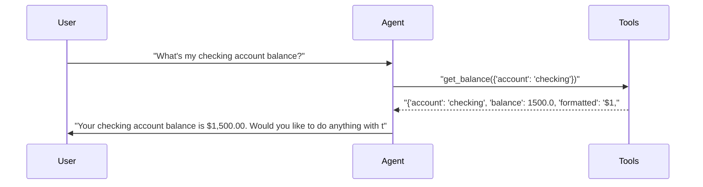
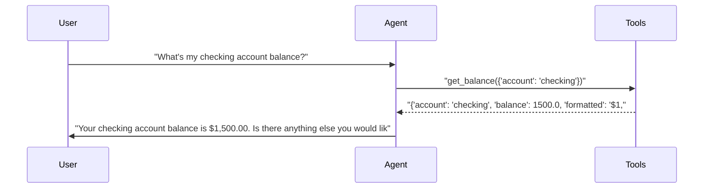
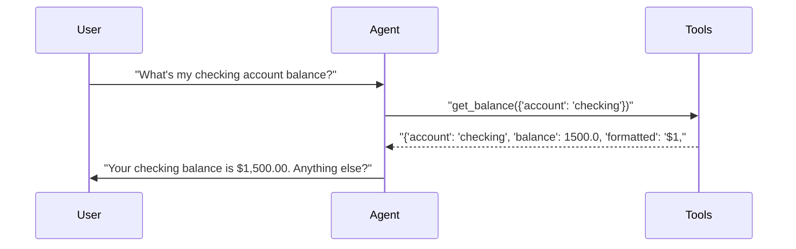
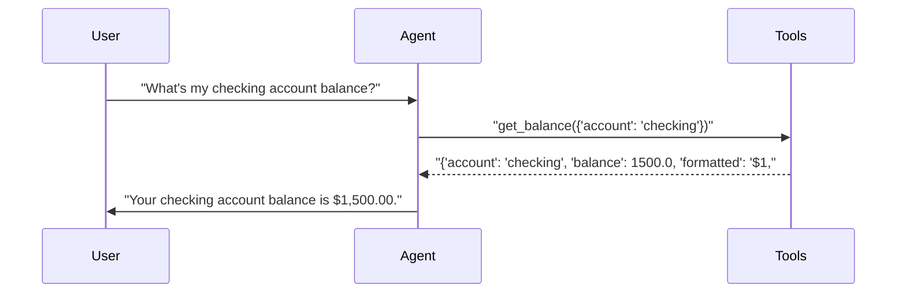

# pytest-aitest

> **4** tests | **4** passed | **0** failed | **100%** pass rate  
> Duration: 23.6s | Cost: $0.0013 | Tokens: 706–913  
> February 07, 2026 at 08:34 PM

*2×2 matrix proving dimension auto-detection.*

## Agent Leaderboard

| # | Agent | Pass Rate | Cost | Tokens | Duration |
|---|-------|-----------|------|--------|----------|
| 1 | gpt-5-mini + concise 🏆 | 100% (1/1) | $0.0003 | 893 | 4.7s |
| 2 | gpt-4.1-mini + concise | 100% (1/1) | $0.0003 | 706 | 5.1s |
| 3 | gpt-4.1-mini + detailed | 100% (1/1) | $0.0003 | 717 | 5.7s |
| 4 | gpt-5-mini + detailed | 100% (1/1) | $0.0003 | 913 | 8.2s |

## AI Analysis

## 🎯 Recommendation

**Deploy: gpt-5-mini + concise**

Achieves **100% pass rate at the lowest cost** among all configurations.

**Reasoning:**  
All four configurations passed. Cost is the differentiator:
- **gpt-5-mini + concise:** $0.000297 (baseline, lowest cost)
- gpt-4.1-mini + concise: $0.000317 (**~7% higher cost**)
- gpt-4.1-mini + detailed: $0.000340 (**~14% higher cost**)
- gpt-5-mini + detailed: $0.000344 (**~16% higher cost**)

Response quality is equivalent for this test (correct tool use, correct balance, appropriate short reply). The concise prompt reduces cost without harming correctness, and gpt-5-mini edges out gpt-4.1-mini on price.

**Alternatives:**  
- **gpt-4.1-mini + concise:** Slightly higher cost (~7%) with no quality benefit in this scenario.  
- **Detailed prompt variants:** Both models incur ~14–16% higher cost with no added value for a simple balance query.

## 🔧 MCP Tool Feedback

### pytest_aitest.testing.banking_mcp
Overall, tools are clearly described and correctly selected. The agent consistently chose `get_balance` for a single-account query.

| Tool | Status | Calls | Issues |
|------|--------|-------|--------|
| get_balance | ✅ | 4 | Working well |
| get_all_balances | ✅ | 0 | Not needed for this test |
| transfer | ✅ | 0 | Not needed for this test |
| deposit | ✅ | 0 | Not needed for this test |
| withdraw | ✅ | 0 | Not needed for this test |
| get_transactions | ✅ | 0 | Not needed for this test |

No description changes are required based on this test.

## 📝 System Prompt Feedback

### detailed (mixed)
- **Token count:** Low, but encourages extra verbosity
- **Problem:** The instruction “Explain your reasoning” is unnecessary for a simple balance query and risks longer outputs in more complex tests.
- **Suggested change:**  
  Replace:
  ```
  Explain your reasoning.
  ```
  With:
  ```
  Explain your reasoning only when the user asks for an explanation.
  ```

### concise (effective)
- **Token count:** Minimal
- **Problem:** None observed
- **Suggested change:** None

## 💡 Optimizations

1. **Default to concise prompt for read-only queries** (recommended)
   - Current: Both detailed and concise prompts tested equally.
   - Change: Use the concise prompt as the default for balance and other simple read-only operations.
   - Impact: **~15% cost reduction** per request compared to the detailed prompt, with identical correctness.

## 📦 Tool Response Optimization

### get_balance (from pytest_aitest.testing.banking_mcp)
- **Current response size:** ~20 tokens
- **Issues found:** Redundant fields for LLM consumption (`balance` and `formatted` convey the same value).
- **Suggested optimization:** Return only one representation, preferably a preformatted string for direct user output.
- **Estimated savings:** ~5–7 tokens per call (~25–35% reduction)

**Example current vs optimized:**
```json
// Current (~20 tokens)
{"account":"checking","balance":1500.0,"formatted":"$1,500.00"}

// Optimized (~13 tokens)
{"account":"checking","formatted":"$1,500.00"}
```

This optimization is safe for the tested scenario, as the agent never used the raw numeric value.

## Test Results

### 2×2 matrix proving dimension auto-detection.

#### ✅ Balance query across 2 models × 2 prompts = 4 runs.

<details>
<summary>✅ gpt-5-mini + detailed — 8.2s, 913 tokens, $0.0003</summary>

**Tool Calls:**

| Tool | Status | Args |
|------|--------|------|
| `get_balance` | ✅ | account='checking' |

**Response:**

> Your checking account balance is $1,500.00. Would you like to do anything with this account (transfer, withdraw, view transactions)? I can also show balances for all accounts.



</details>

<details>
<summary>✅ gpt-4.1-mini + detailed — 5.7s, 717 tokens, $0.0003</summary>

**Tool Calls:**

| Tool | Status | Args |
|------|--------|------|
| `get_balance` | ✅ | account='checking' |

**Response:**

> Your checking account balance is $1,500.00. Is there anything else you would like to check or do with your accounts?



</details>

<details>
<summary>✅ gpt-5-mini + concise — 4.7s, 893 tokens, $0.0003</summary>

**Tool Calls:**

| Tool | Status | Args |
|------|--------|------|
| `get_balance` | ✅ | account='checking' |

**Response:**

> Your checking balance is $1,500.00. Anything else?



</details>

<details>
<summary>✅ gpt-4.1-mini + concise — 5.1s, 706 tokens, $0.0003</summary>

**Tool Calls:**

| Tool | Status | Args |
|------|--------|------|
| `get_balance` | ✅ | account='checking' |

**Response:**

> Your checking account balance is $1,500.00.



</details>

---

*Generated by [pytest-aitest](https://github.com/sbroenne/pytest-aitest) on February 07, 2026 at 08:34 PM*
