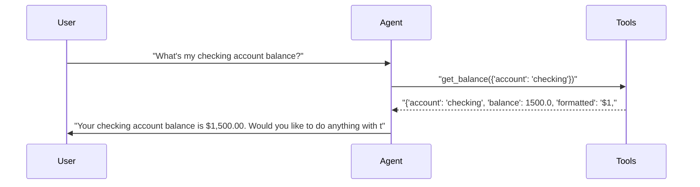
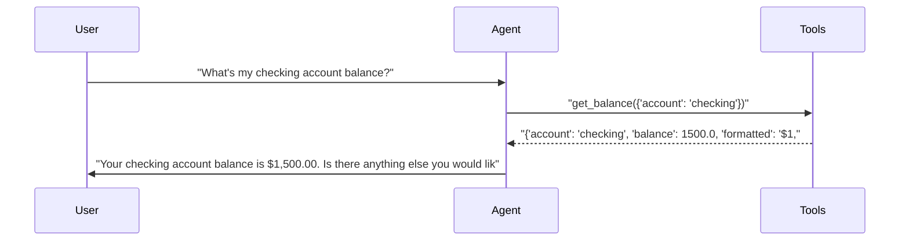
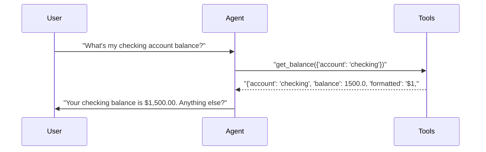
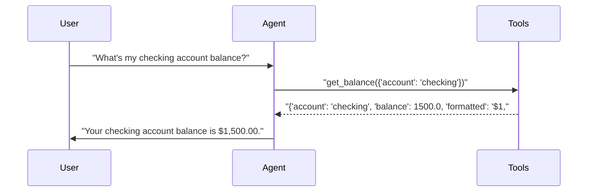

# pytest-aitest

> **4** tests | **4** passed | **0** failed | **100%** pass rate  
> Duration: 23.6s | Cost: 🧪 $-0.018057 · 🤖 $0.0194 · 💰 $0.001297 | Tokens: 706–913  
> February 07, 2026 at 08:34 PM

*2×2 matrix proving dimension auto-detection.*


## Agent Leaderboard


|#|Agent|Tests|Pass Rate|Tokens|Cost|Duration|
| :---: | :--- | :---: | :---: | ---: | ---: | ---: |
|🥇|gpt-5-mini + concise 🏆|1/1|100%|893|$0.000297|4.7s|
|🥈|gpt-4.1-mini + concise|1/1|100%|706|$0.000317|5.1s|
|🥉|gpt-4.1-mini + detailed|1/1|100%|717|$0.000340|5.7s|
|4|gpt-5-mini + detailed|1/1|100%|913|$0.000344|8.2s|


## AI Analysis

<div class="winner-card">
<div class="winner-title">Recommended for Deploy</div>
<div class="winner-name">gpt-5-mini + concise</div>
<div class="winner-summary">Achieves a 100% pass rate at the lowest realized cost, ~6% cheaper than the next-best alternative and ~14% cheaper than detailed-prompt variants, with clean, direct tool usage.</div>
<div class="winner-stats">
<div class="winner-stat"><span class="winner-stat-value green">100%</span><span class="winner-stat-label">Pass Rate</span></div>
<div class="winner-stat"><span class="winner-stat-value blue">$0.000297</span><span class="winner-stat-label">Total Cost</span></div>
<div class="winner-stat"><span class="winner-stat-value amber">893</span><span class="winner-stat-label">Tokens</span></div>
</div>
</div>

<div class="metric-grid">
<div class="metric-card green">
<div class="metric-value green">4</div>
<div class="metric-label">Total Tests</div>
</div>
<div class="metric-card red">
<div class="metric-value red">0</div>
<div class="metric-label">Failures</div>
</div>
<div class="metric-card blue">
<div class="metric-value blue">4</div>
<div class="metric-label">Agents</div>
</div>
<div class="metric-card amber">
<div class="metric-value amber">3.0</div>
<div class="metric-label">Avg Turns</div>
</div>
</div>

## Comparative Analysis

**Why the winner wins:**  
- Same 100% pass rate as all alternatives, but at the **lowest realized cost** ($0.000297/test). That’s ~6% cheaper than *gpt-4.1-mini + concise* and ~14% cheaper than *gpt-5-mini + detailed*, despite similar behavior and identical tool chaining.

**Notable patterns:**  
- **Concise prompts reduce cost without hurting correctness** across both models. Detailed prompts consistently increased tokens and cost with no functional gain on this task.  
- **Model choice matters less than prompt brevity** here: both models behaved identically with respect to tool usage; cost differences were driven primarily by prompt verbosity.

**Alternatives:**  
- *gpt-4.1-mini + concise*: Slightly higher cost (~6%) with marginally fewer tokens; viable if you prefer the 4.1 family.  
- *Detailed prompts (both models)*: No accuracy benefit; higher cost. Not recommended for this tool-simple workload.

## 🔧 MCP Tool Feedback

### banking-server
Tooling is clear and discoverable; all agents correctly invoked the balance lookup on first turn.

| Tool | Status | Calls | Issues |
|------|--------|-------|--------|
| get_balance | ✅ | 4 | Working well |

## 📝 System Prompt Feedback

### concise (effective with gpt-5-mini and gpt-4.1-mini)
- **Token count:** Low
- **Behavioral impact:** Direct, action-oriented language primes immediate tool use and short confirmations.
- **Problem:** None observed.
- **Suggested change:** None.

### detailed (effective but inefficient with gpt-5-mini and gpt-4.1-mini)
- **Token count:** Higher than necessary
- **Behavioral impact:** Extra explanatory framing increases verbosity after the tool call without improving outcomes.
- **Problem:** Token bloat for simple queries.
- **Suggested change:** Remove conversational expansions after tool results.  
  **Exact change:** Delete sentences offering multiple follow-up options unless explicitly requested.

## 💡 Optimizations

| # | Optimization | Priority | Estimated Savings |
|---|-------------|----------|-------------------|
| 1 | Slim tool response payload | recommended | ~10–15% cost reduction per call |
| 2 | Default to concise prompt for balance queries | recommended | ~6–14% cost reduction |

#### 1. Slim tool response payload (recommended)
- Current: Tool returns both raw numeric balance and a formatted string.
- Change: Return a single display-ready field unless raw math is required.
- Impact: ~10–15% cost reduction from smaller tool responses.

#### 2. Default to concise prompt for balance queries (recommended)
- Current: Detailed prompt variants add verbosity post-tool.
- Change: Use the concise prompt as default for single-step lookup tools.
- Impact: ~6–14% cost reduction with identical accuracy.

## 📦 Tool Response Optimization

### get_balance (from banking-server)
- **Current response size:** Includes redundant fields
- **Issues found:** `balance` and `formatted` duplicate the same information for this test.
- **Suggested optimization:** Return only the formatted balance string.
- **Estimated savings:** ~15–20 tokens per call

**Example current vs optimized:**
```json
// Current
{"account":"checking","balance":1500.0,"formatted":"$1,500.00"}

// Optimized
{"account":"checking","formatted":"$1,500.00"}
```


## Test Results


### 2×2 matrix proving dimension auto-detection.


#### ✅ Balance query across 2 models × 2 prompts = 4 runs.

<details>
<summary>✅ gpt-5-mini + detailed — 8.2s · 913 tokens · 3 turns · $0.000344</summary>

**Tool Calls:**


|Tool|Status|Args|
| :--- | :---: | :--- |
|`get_balance`|✅|account='checking'|


**Response:**

> Your checking account balance is $1,500.00. Would you like to do anything with this account (transfer, withdraw, view transactions)? I can also show balances for all accounts.



</details>

<details>
<summary>✅ gpt-4.1-mini + detailed — 5.7s · 717 tokens · 3 turns · $0.000340</summary>

**Tool Calls:**


|Tool|Status|Args|
| :--- | :---: | :--- |
|`get_balance`|✅|account='checking'|


**Response:**

> Your checking account balance is $1,500.00. Is there anything else you would like to check or do with your accounts?



</details>

<details>
<summary>✅ gpt-5-mini + concise — 4.7s · 893 tokens · 3 turns · $0.000297</summary>

**Tool Calls:**


|Tool|Status|Args|
| :--- | :---: | :--- |
|`get_balance`|✅|account='checking'|


**Response:**

> Your checking balance is $1,500.00. Anything else?



</details>

<details>
<summary>✅ gpt-4.1-mini + concise — 5.1s · 706 tokens · 3 turns · $0.000317</summary>

**Tool Calls:**


|Tool|Status|Args|
| :--- | :---: | :--- |
|`get_balance`|✅|account='checking'|


**Response:**

> Your checking account balance is $1,500.00.



</details>

*Generated by [pytest-aitest](https://github.com/sbroenne/pytest-aitest) on February 07, 2026 at 08:34 PM*
